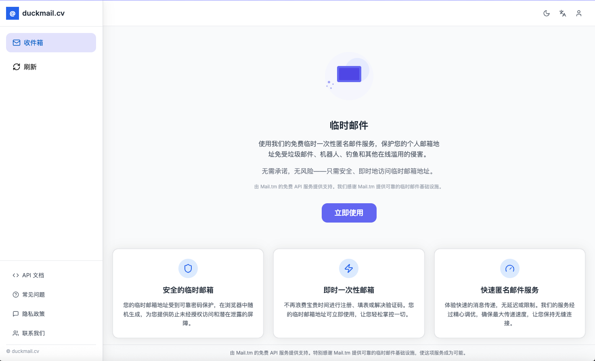
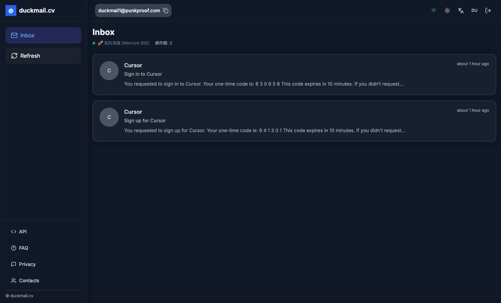

<div align="center">

# Quillmail

**安全、即时、快速的一次性临时邮箱服务**

[](./package.json)
[](https://nextjs.org)
[](https://react.dev)
[](#%E8%AE%B8%E5%8F%AF%E8%AF%81)

中文 | [English](./README.md)

Quillmail 是一个基于 Next.js 16 与 React 19 构建的临时邮箱单页应用。它对接可插拔的
邮箱后端(默认 DuckMail API,可切换 Mail.tm),通过 Mercure SSE 实时接收新邮件,
支持中英双语,并可零配置部署到 Netlify 或 Vercel。

**🌐 在线使用:** <https://duckmail.local> · **📚 接口文档页:** `/zh/api-docs`

</div>

<div align="center">
  
  <p><em>主界面 —— 简洁现代的设计</em></p>
  
  <p><em>邮件管理 —— 新邮件实时送达</em></p>
</div>

## ✨ 特性

- 📧 **多账户管理** —— 创建、切换、删除多个临时邮箱;账户与 Token 按账户本地持久化。
- 🔄 **Mercure SSE 实时收信** —— 新邮件通过 `use-mercure-sse` 即时推送;内置 `/api/sse` 路由以心跳保活,`use-smart-mail-checker` 在 SSE 不可用时自动回退到轮询。
- 🔧 **多 API 提供商** —— 运行时切换 DuckMail API(`api.duckmail.local`,默认)与 Mail.tm(`api.mail.tm`);可在设置中启用/禁用提供商(Mail.tm 默认禁用,且在 Vercel 出口 IP 上不可用)。
- 🔑 **可选 API Key** —— 无 Key 可使用公共域名,基础功能完整;有 Key 可解锁更多域名及私有域名创建(在应用内设置面板配置)。
- 🌐 **中英双语(i18n)** —— 基于 `next-intl`,路由带语言前缀(`/zh/...`、`/en/...`),自动检测浏览器语言;默认语言为 `zh`。
- 🌙 **深色模式** —— 基于 `next-themes` 的明暗主题切换。
- 🎨 **现代化界面** —— HeroUI 组件 + Tailwind CSS,搭配 Framer Motion 动画与 lucide 图标。
- 🛡️ **内置 API 代理** —— Next.js 路由处理器(`/api/mail`)代理所有邮箱 API 请求,注入提供商 Base URL,容忍慢上游(15 秒超时),浏览器不直接跨域访问后端。
- 📖 **站内文档** —— 本地化的接口文档、FAQ 与隐私页:`/[locale]/api-docs`、`/[locale]/faq`、`/[locale]/privacy`。

## 🧱 技术栈

| 层级 | 选型 |
| --- | --- |
| 框架 | [Next.js](https://nextjs.org) 16(App Router、Route Handlers) |
| UI 运行时 | [React](https://react.dev) 19 |
| 样式 | Tailwind CSS 3.4 + tailwindcss-animate |
| 组件 | [HeroUI](https://heroui.com)(主要)、Radix UI 基元、lucide-react 图标 |
| 国际化 | [next-intl](https://next-intl.dev) 4(`zh` / `en`) |
| 主题 | [next-themes](https://github.com/pacocoursey/next-themes) |
| 实时通信 | Mercure Hub + 原生 `EventSource` / `@microsoft/fetch-event-source` |
| 表单与校验 | react-hook-form + zod |
| 语言 | TypeScript 5 |

> 需要 **Node.js ≥ 20.9** 与 **pnpm**。

## 🚀 快速开始

```bash
# 1. 安装依赖
pnpm install

# 2. 启动开发服务器
pnpm dev

# 3. 打开 http://localhost:3000(会根据浏览器语言重定向到 /zh 或 /en)
```

生产构建:

```bash
pnpm build
pnpm start
```

无需任何环境变量 —— 提供商端点(DuckMail、Mail.tm、Mercure Hub)已在 `lib/api.ts`
中预配置,可在应用设置面板中切换。

## 🔌 API 提供商

Quillmail 与提供商解耦:一个提供商就是 `lib/api.ts` 中解析的
`{ id, name, baseUrl, mercureUrl }` 配置。

- **DuckMail**(默认)—— 自建邮箱后端。所有接口无需 Key 即可使用;创建账户会返回
  Token,用于邮箱相关操作的鉴权。`domains` 与 `accounts` 接口额外支持 API Key 请求头,
  可解锁该 Key 下的私有域名。
- **Mail.tm** —— 知名公共临时邮箱 API。默认禁用(可在设置中启用);注意 Mail.tm
  屏蔽 Vercel 出口 IP,Vercel 部署上不可用。

提供商行为要点:

- 请求经 `/api/mail` 代理,该路由通过 `X-API-Provider-Base-URL` 请求头路由到所选提供商。
- 频率限制:12 QPS。邮件保留 3 天,之后自动删除。
- 通过 API 创建账户时可设置 `expiresIn` 参数(秒);`0` / `-1` = 永不过期,
  不传 = 默认 24 小时后自动清理;网页端创建的账户默认不过期。
- 无密码找回功能 —— 临时邮箱本就是一次性的。

## ☁️ 部署

### Netlify(推荐)

仓库内置 [`netlify.toml`](./netlify.toml)(锁定 Node 20.9.0、pnpm 构建),
点击按钮后 Netlify 会自动 fork 项目并开始部署:

[](https://app.netlify.com/start/deploy?repository=https://github.com/Dyrk2020/Quillmail)

### Vercel

Vercel 会自动检测 Next.js 项目,无需额外配置:

[](https://vercel.com/new/clone?repository-url=https://github.com/Dyrk2020/Quillmail)

> ⚠️ 在 Vercel 上请保持 Mail.tm 提供商禁用(其 IP 被 Mail.tm 屏蔽);
> DuckMail 提供商开箱即用。

## 📁 目录结构

```
Quillmail/
├── app/
│   ├── [locale]/            # 本地化页面:首页、api-docs、faq、privacy
│   └── api/
│       ├── mail/            # 代理路由 → 所选邮箱 API 提供商
│       └── sse/             # SSE 中继,心跳保活
├── components/              # UI:header、sidebar、message list/detail、settings…
│   └── ui/                  # 基础 UI 组件(shadcn 风格)
├── contexts/                # API 提供商、鉴权、邮件状态 Context
├── hooks/                   # Mercure SSE、智能收信检查、Toast、移动端
├── i18n/                    # next-intl routing / request / navigation 配置
├── lib/                     # API 客户端(提供商、账户、邮件)、工具函数
├── messages/                # 翻译文件:en.json、zh.json
├── types/                   # 共享 TypeScript 接口(Domain、Account、Message)
├── middleware.ts            # next-intl 语言路由中间件
├── netlify.toml             # Netlify 构建配置(Node 20.9、pnpm build)
└── next.config.mjs          # next-intl 插件,关闭图片优化
```

## 📄 许可证

本项目采用 [MIT 许可证](LICENSE) 发布。

## ☕ 支持一下

如果 Quillmail 对你有帮助,欢迎点个 Star;如果想帮助分担后端成本:

[](https://afdian.com/a/syferie)

## 📮 联系

问题或建议?提一个
[Issue](https://github.com/Dyrk2020/Quillmail/issues),或发邮件到
[syferie@proton.me](mailto:syferie@proton.me)。